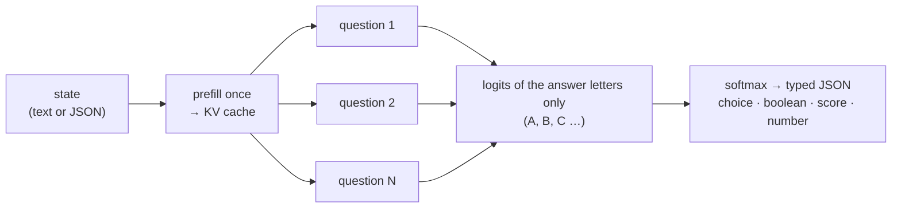

<div align="center">


# Rizzo Flow

### The open, local take on Jev: typed decisions from an LLM, without generating a single token

**_Unstructured state in → typed, probabilistic decisions out. On your own machine._**

<p>


</p>

<p>


</p>

<sub>🌐 <a href="https://rizzo-ai-academy.github.io/rizzo-flow/"><b>Website</b></a> · A project by <a href="https://www.rizzoaiacademy.com"><b>Rizzo AI Academy</b></a> · 🇮🇹 <a href="docs/README.it.md">Documentazione dettagliata in italiano</a></sub>

</div>

**Rizzo Flow** is an open-source, local-first implementation of the idea behind
[**Jev**](https://typesafe.ai/blog/introducing-system-one-models-and-jev), TypeSafe's "System One"
model: a *function call with judgment* that takes unstructured state and returns **typed decisions
with probabilities** — a yes/no, a choice among options, a score on a rubric, a number — instead
of text you then have to parse.

Jev is a closed, hosted service. Rizzo Flow gives you the same programming model **on your own
hardware, with open weights, and with the same HTTP interface**, so code written against the
TypeSafe API can point at `localhost` by changing one URL. It runs on
[llama.cpp](https://github.com/ggml-org/llama.cpp), so the hardware can be an Apple, NVIDIA, AMD
or Intel GPU, or no GPU at all.

> **Independent project.** Rizzo Flow is not affiliated with TypeSafe and does not reproduce Jev's
> proprietary architecture or its RLCD training. It reproduces the *interface pattern* with an
> open model (Spark-X2.5, with our own [LoRA fine-tune](#fine-tuning) on public data), in the
> spirit of [SemIf](https://github.com/TheoLeeCJ/SemIf), which inspired it. Probabilities are
> **uncalibrated** unless you calibrate them on your own data, and
> we make no claim of matching Jev or SemIf in quality. Every number below comes with its caveats.

**New: fine-tuned weights.** Since 25 September 2026 the default model is Spark-X2.5 with our own
LoRA fine-tune for typed decisions ([how and on what](#training-and-calibration)). On the
[`typed-decisions`](https://huggingface.co/datasets/LocalLLaMA/typed-decisions) benchmark, same GPU,
Q8_0:

| | Accuracy ↑ | KL from gold ↓ | Brier ↓ | ECE ↓ |
| --- | ---: | ---: | ---: | ---: |
| Spark-X2.5-4B, original | 0.574 | 2.899 | 0.480 | 0.349 |
| **Rizzo Flow 4B, fine-tuned** | **0.648** | **0.452** | **0.205** | **0.112** |
| TypeSafe Jev 1.13.0 (its dataset card) | 0.727 | 1.442 | 0.148 | – |

Better answers (+7.4 points) and much better-shaped probabilities, still below Jev in accuracy.

<div align="center">
<br />
<a href="assets/snake_run.gif"></a>

<sub>🐍 <b>Fast enough to play Snake</b> — every move is one <code>POST /v1/decisions</code>. Recorded at <b>real speed</b>, not sped up:
140 moves in 25.6 s (≈ 5.5 per second), about <b>150 ms per decision</b> round trip, <b>0 generated tokens</b>.<br />
Spark-X2.5-4B at 8 bit on an RTX 5060 Ti, recorded with the earlier MLX runtime (today's llama.cpp runtime is ~1.8× faster per decision) · one game, not a benchmark · <a href="#snake-demo">about the demo ↓</a> · <a href="#quickstart">run it yourself ↓</a></sub>
</div>

---

## Local 3D driving sandbox

Run `uv run rizzo serve`, open <http://127.0.0.1:8017/drive>, and click **Start driving**.
The city simulator extracted from Jev Drive calls the resident Rizzo engine directly for
speed, lane, route and attention decisions. Simulation time pauses during local inference.
Weather, traffic, turns, hazards and brake assist are available in the panel. Three.js is
bundled locally; no npm installation, TypeSafe SDK, API key or second server is needed.
The previous driving demo remains at `/drive-classic`.

## Quickstart

You need Python ≥ 3.11, git and [uv](https://docs.astral.sh/uv/). The same four commands work on
macOS, Windows and Linux; nothing is compiled and no GPU toolkit is installed.

```bash
git clone https://github.com/Rizzo-AI-Academy/rizzo-flow && cd rizzo-flow
uv sync --locked          # seconds: four small Python packages
uv run rizzo download     # llama.cpp for this machine + Rizzo Flow 4B Q8_0 (~4.4 GB)
uv run rizzo serve        # → http://127.0.0.1:8017/playground
```

`rizzo download` is the only slow step, and it is all download: the model (4.4 GB) plus the
llama.cpp runtime (about 570 MB with CUDA, 30 MB with Vulkan, 11 MB on a Mac). An interrupted
download resumes where it stopped. In a hurry? `uv run rizzo download --size 1.7b` fetches a
1.8 GB model that is fine for a first look and [much less accurate](#results-so-far) afterwards.

Then open <http://127.0.0.1:8017/playground>, pick an example from the **Examples…** menu (or
write your own state and questions) and press **Run** — or call the API:

```bash
curl http://127.0.0.1:8017/v1/systemone \
  -H 'Content-Type: application/json' \
  -d '{"state": "Help! My payouts have been failing for 3 days.", "model": "rizzo-latest",
       "questions": {"is_urgent": {"type": "noul", "instructions": "Does this convey urgency?"}}}'
```

<details>
<summary>The same call from Windows PowerShell</summary>

```powershell
$body = @{ state = "Help! My payouts have been failing for 3 days."; model = "rizzo-latest"
           questions = @{ is_urgent = @{ type = "noul"; instructions = "Does this convey urgency?" } }
         } | ConvertTo-Json -Depth 5
Invoke-RestMethod http://127.0.0.1:8017/v1/systemone -Method Post -ContentType "application/json" -Body $body |
  ConvertTo-Json -Depth 6
```
</details>

No server needed for one-off runs: `uv run rizzo decide examples/ticket.json`. If you prefer an
activated environment, `source .venv/bin/activate` (PowerShell: `.venv\Scripts\activate`) and drop
the `uv run` prefix.

<div align="center">
<br />
<a href="assets/playground.webp"></a>

<sub>🦔 <b>The built-in playground</b> — one state, several questions answered in parallel, probability bars, timings and the
equivalent cURL. Interface in Italian or English. (Screenshot taken with the earlier MLX runtime on an M4 Pro.)</sub>
</div>

### Which hardware, and what we have actually run

`rizzo download` picks an official prebuilt llama.cpp package for your machine and checks its
sha256. `rizzo devices` shows what the runtime sees and what `--device auto` will use.

| Your machine | Build picked (`--runtime auto`) | Status |
| --- | --- | --- |
| Windows or Linux, NVIDIA GPU | `cuda` — CUDA 13 libraries included; needs a recent driver, no toolkit | **tested on Windows 10 + RTX 5060 Ti**: every current number in this README. Linux not tried |
| Windows or Linux, AMD or Intel GPU | `vulkan` — uses the GPU driver you already have | Community reports cover an AMD Radeon 780M and Intel Iris Xe; see [#11](https://github.com/Rizzo-AI-Academy/rizzo-flow/issues/11) and [#7](https://github.com/Rizzo-AI-Academy/rizzo-flow/issues/7). The Intel run used Q4_K_M; these reports have not been independently reproduced by the maintainers. |
| Mac, Apple Silicon | `metal` | A community report covers an M3 Pro; see [#5](https://github.com/Rizzo-AI-Academy/rizzo-flow/issues/5). The run has not been independently reproduced by the maintainers. The two fixes it needed (context freed before exit, a warning when an x86_64 Python under Rosetta hides the GPU) are merged ([#4](https://github.com/Rizzo-AI-Academy/rizzo-flow/pull/4)), and so is `--device metal` on M4 ([#9](https://github.com/Rizzo-AI-Academy/rizzo-flow/issues/9)). |
| No GPU | `vulkan` falls back to the CPU; or `--runtime cpu` | CPU mode was reported on an Intel laptop with an iGPU ([#7](https://github.com/Rizzo-AI-Academy/rizzo-flow/issues/7)); a GPU-free host has not been tested. |

Other builds on request: `uv run rizzo download --only runtime --runtime rocm` (AMD, ROCm/HIP),
`--runtime sycl` (Intel oneAPI), `--runtime cpu`. Several builds can live side by side and
`--device vulkan` (or `cuda`, `metal`, …) picks one at start-up; a named family is a requirement,
never silently downgraded to the CPU. To use your own llama.cpp build, point `RIZZO_LLAMA_DIR` at
the folder that holds `libllama`: it must be commit `161755f`, because the bindings are tied to
that header.

Everything is pinned: llama.cpp release
[`b11081`](https://github.com/ggml-org/llama.cpp/releases/tag/b11081) from its official GitHub
releases, and the GGUF files, by commit and sha256. By default `rizzo download` fetches **our
fine-tuned weights** ([4B](https://huggingface.co/rizzoaiacademy/rizzo-flow),
[1.7B](https://huggingface.co/rizzoaiacademy/rizzo-flow-1.7b): Spark-X2.5 with a LoRA trained for
typed decisions and merged in, see [Fine-tuning](#fine-tuning)). `--weights base` fetches the
original files published by the model's authors instead
([4B](https://huggingface.co/XHToken/Spark-X2.5-4B-GGUF),
[1.7B](https://huggingface.co/XHToken/Spark-X2.5-1.7B-GGUF)). The runtime goes to `runtimes/`,
the weights to `models/`, both git-ignored.

### Models and options

| `--size` | `--weights flow` (default): our fine-tune | `--weights base`: original Spark-X2.5 | Status |
| --- | --- | --- | --- |
| `4b` (default) | `q8_0` 4.4 GB (default) · `q4_k_m` 2.6 GB · `bf16` 8.2 GB | `q8_0` 4.4 GB · `q4_k_m` 2.6 GB · `bf16` 8.2 GB | recommended |
| `1.7b` | `q8_0` 1.8 GB (default) · `q4_k_m` 1.1 GB · `bf16` 3.4 GB | `q8_0` 1.8 GB · `q4_k_m` 1.1 GB · `bf16` 3.4 GB | ~2× faster, **much less accurate**. The base 1.7B picks "cannot determine" almost every time when abstention is enabled: use it with `"allow_abstain": false` (the Jev-compatible endpoint always does) and check it on your own data |

The fine-tuned Q4_K_M files are ours (`llama-quantize` b11081 from the BF16 GGUF, no importance
matrix): on typed-decisions the 4B one ties Q8_0, the 1.7B one loses 5 points (see
[Fine-tuning](#fine-tuning)). The served model
ID says which weights answer: `rizzo-flow-4b-q8_0` for the fine-tune, `rizzo-spark-x2.5-4b-q8_0`
for the original file (`rizzo-latest` always works).

`rizzo serve` flags: `--size`, `--quant`, `--weights flow|base`, `--device auto|gpu|cpu|cuda|vulkan|metal|rocm|sycl`,
`--port`, `--host`, `--batch-size` (question micro-batch, default 4), `--ctx` (token limit per
question, default 8192), `--threads` (CPU), `--model /path/to/file.gguf` (overrides `--size`),
`--calibration fit.json`. Set `RIZZO_API_KEY=...` before starting for Bearer auth on the
Jev-compatible endpoints. The model loads in about 10 seconds.

Quantization changes probabilities, and so does the hardware (CUDA, Vulkan and Metal round
differently): compare on your own workload, and note that a calibration is bound to the runtime,
backend and file it was fitted on.

<details>
<summary><b>Optional: the MLX runtime</b> (<code>--backend mlx</code>) — what this project ran on until September 2026</summary>

Every result marked "MLX" below was measured with it, and it is still there as an opt-in:

```bash
uv sync --locked --extra mlx                  # Apple Silicon · or --extra cuda (NVIDIA) · or --extra cpu
uv run --no-sync rizzo download --backend mlx # the fine-tune as BF16 safetensors, ~8 GB
uv run --no-sync rizzo serve --backend mlx --bits 8   # --bits 4|8 quantize in memory; omit for BF16
```

With an MLX extra installed use `uv run --no-sync`: a plain `uv run` re-syncs the environment
without the extra and removes it. Prompt, API and result format are the same; probabilities are
not (different kernels and quantization). MLX loads the same fine-tune from the safetensors
checkpoint in the same Hugging Face repository (the weights are bit-identical to the BF16 GGUF;
on MLX-CUDA the 4B matches llama.cpp BF16 within 0.001); `--weights base` loads XHToken's
original checkpoint.
</details>

---

## Training and calibration

### Fine-tuning

The default weights are Spark-X2.5 with a **LoRA fine-tune for typed decisions**, merged in and
converted to GGUF: [`rizzoaiacademy/rizzo-flow`](https://huggingface.co/rizzoaiacademy/rizzo-flow)
(4B) and [`rizzoaiacademy/rizzo-flow-1.7b`](https://huggingface.co/rizzoaiacademy/rizzo-flow-1.7b).
The goal was not new knowledge but better-shaped answers: the base model puts 0.9999 on its pick
even when it is wrong, and the fine-tune learns to spread probability when the evidence is split.

- **The same forward pass as inference.** No text target: the loss is a soft cross-entropy between
  the target distribution and the softmax over the answer letters at the last prompt position,
  with the exact prompts of `spark-decisions-v3`. Only the LoRA adapters train (r 16, alpha 32,
  every linear layer of attention and MLP; 32.4M parameters on the 4B, 16.7M on the 1.7B).
- **Public data, no Jev outputs.** 28,321 questions from
  [`tasksource/procedural-typed-decisions`](https://huggingface.co/datasets/tasksource/procedural-typed-decisions),
  [`ZefanCai/Open-Jev`](https://huggingface.co/datasets/ZefanCai/Open-Jev)
  (`release-v2-redistributable`, without `customer-control-v1` and without `workflow-controls-v1`,
  which shares its four workflows with the benchmark below) and 12 configs of
  [`Praveenrajus/jev-bench`](https://huggingface.co/datasets/Praveenrajus/jev-bench). Every
  training state containing text from our evaluation sets (SemIf fixtures, typed-decisions test,
  smoke) was removed.
- **One epoch**, AdamW lr 5e-5, 16 questions per step, 1,770 steps: 41 minutes (4B) and 19 minutes
  (1.7B) on one RTX PRO 6000. The adapter alone and the training log are in the Hugging Face
  repositories. Pipeline, data vetting and every choice: [docs/training.md](docs/training.md)
  (Italian); scripts in [`training/`](training/).

<a href="assets/training_charts.png"></a>

*Dev curves from Weights & Biases: red = 4B, green = 1.7B (the blue dot is a 10-step smoke run).
600 questions from the `validation` splits of the three sources, never trained on, evaluated at
step 0 and every 200 steps; accuracy = argmax against the argmax of the target distribution.
These are in-distribution numbers: the benchmark below is the independent measurement.*

### Results on typed-decisions

Test split of [`LocalLLaMA/typed-decisions`](https://huggingface.co/datasets/LocalLLaMA/typed-decisions)
(config `all`: 400 cases, 2,000 decisions, five questions over one shared state per case, sent as
`/v1/systemone` requests; `scripts/typed_decisions.py`). Base and fine-tune measured on the same
machine: llama.cpp b11081, CUDA, RTX 5060 Ti, Q8_0.

| | Accuracy ↑ | KL from gold ↓ | Brier ↓ | ECE ↓ | Score within 1 level | p50 per case |
| --- | ---: | ---: | ---: | ---: | ---: | ---: |
| Spark-X2.5-4B, base | 0.574 | 2.899 | 0.480 | 0.349 | 0.688 | 201 ms |
| **Rizzo Flow 4B (default)** | **0.648** | **0.452** | **0.205** | **0.112** | **0.931** | 195 ms |
| Rizzo Flow 4B, Q4_K_M | 0.650 | 0.436 | 0.201 | 0.093 | 0.935 | 198 ms |
| Spark-X2.5-1.7B, base | 0.530 | 3.031 | 0.496 | 0.348 | 0.636 | 117 ms |
| Rizzo Flow 1.7B | 0.544 | 0.694 | 0.275 | 0.169 | 0.786 | 109 ms |
| Rizzo Flow 1.7B, Q4_K_M | 0.490 | 0.640 | 0.279 | 0.192 | 0.790 | 107 ms |
| TypeSafe Jev 1.13.0, from the dataset card (not re-measured) | 0.727 | 1.442 | 0.148 | – | – | – |

Reading this honestly:

- **4B: better answers and much better probabilities.** Accuracy +0.074, 95% interval
  [+0.050, +0.101] (paired bootstrap over cases); KL from the gold distribution drops 6×. Every
  workflow improves, most of all `agent_trace_observability` (0.366 → 0.502), where the base
  answered "critical, needs human review" with p ≈ 0.9999 on almost every trace. Three questions
  of twenty get worse (`agent_trace/outcome`, `invoice/duplicate`, `security/severity`).
- **1.7B: probabilities improve, accuracy does not** (+0.014 [−0.014, +0.043], noise), and
  `security_incidents` drops 0.612 → 0.514. Use the 4B when accuracy matters.
- **Q4_K_M:** the 4B one ties Q8_0 on this benchmark (+0.002 [−0.011, +0.015]); on the original
  weights Q4_K_M cost 4 points on SemIf's fixtures, not re-run here. The 1.7B one loses −0.054
  [−0.070, −0.037]: at 2.6 GB the 4B Q4_K_M is the better small option.
- **Still below Jev's published accuracy** (0.727). Its KL and Brier come from the card, computed
  with formulas the card does not give (ours reproduce its Uniform row exactly). The gold labels
  come from a ~4B teacher model, not from humans.
- **Not zero-shot any more, but no leak**: the fine-tune has seen the typed-decision format, not
  these workflows or states.
- **SemIf fixtures (4B Q8_0)**: `authored144` 0.845 (SemIf Q8 0.819, tied: +0.027 [−0.038,
  +0.099]), `perturbations108` 0.946 (SemIf 0.766, +0.180 [+0.108, +0.267]), but worse than the
  base weights on missing evidence (0.583 against 0.750). Details in
  [Results so far](#results-so-far); the other tables there are the base weights.
- **Not yet re-measured on the fine-tune**: our smoke set and the 1.7B on the SemIf fixtures.
  `--weights base` keeps the original files one flag away.

The same fine-tune runs on **MLX** too (`--backend mlx` downloads it as BF16 safetensors from the
same repositories): its weights are bit-identical to the BF16 GGUF, and on MLX-CUDA the 4B gives
the same prompts and the same probabilities as llama.cpp BF16 within 0.001. The MLX runtime has
not been scored on the whole benchmark.

Reports (git-ignored, local): `results/local-typed-decisions/`.

### Calibration

Two different things improve the probabilities, and they add up:

1. **The fine-tune** (above) reshapes them for everyone: on typed-decisions the expected
   calibration error drops from 0.349 to 0.112 on the 4B (0.348 → 0.169 on the 1.7B), and the
   Brier score from 0.480 to 0.205. The base model's 0.9999 on wrong answers mostly disappears.
2. **Temperature scaling on your own data** makes them match *your* domain. Even after the
   fine-tune the probabilities are **not calibrated** for a workload we have never seen, and
   thresholds designed for Jev's `confidence` do not transfer.

Temperature scaling is built in, per primitive, and bound to a fingerprint of weights, precision,
runtime, compute backend and prompt version: a fit made on the base weights does not load on the
fine-tune, and one made on CUDA does not load on Vulkan.

```bash
rizzo calibrate calibration.jsonl --fingerprint MODEL_HASH --output calibration-fit.json
rizzo serve --calibration calibration-fit.json
```

`MODEL_HASH` is the `fingerprint` in the response metadata (`x_rizzo` on the Jev-compatible
endpoint). You need labelled data from your own domain, a separate calibration set, and a
held-out test. The evaluator reports accuracy, NLL, Brier, ECE and coverage.

---

## Why "System One"

An LLM asked to classify something *writes* an answer: token by token, slowly, in a format you
hope is valid JSON. But for a decision you do not need text — you need **which option, and how
sure**. That information is already in the model after a single forward pass: it is the
probability it assigns to each possible answer.

Rizzo Flow reads exactly that and nothing else:



1. **Every question becomes a multiple choice.** Each candidate answer is mapped to one uppercase
   letter. The tokenizer is checked at request time: every letter must be exactly one token, in
   context. 26 letters → at most **26 answer slots** per question.
2. **The state is processed once.** It sits at the start of the prompt, so it is prefilled a
   single time. Every question then branches from it: the branches *share* the state's KV cache
   cells instead of copying them, and their texts run together in one unpadded micro-batch.
3. **Only the answer letters are read.** One position per question, the logits of the allowed
   letters, nothing else. Nothing is sampled.
4. **Plain Python turns logits into typed output.** Softmax, optional temperature, expected values
   for scores and numbers, abstention policy, and a schema-validated JSON response.

No decoding loop, no output parsing, no JSON repair, no type errors by construction.
"Zero generated tokens" is not zero latency: prefill and questions still cost compute — about
50 ms for one short decision and 1 second for 21 questions on a 2,000-token state, on an
RTX 5060 Ti at 8 bit.

---

## Primitives

### Native API — `POST /v1/decisions`

| Type | You provide | You get |
| --- | --- | --- |
| `boolean` | optional descriptions of *true* / *false* | `value`, probability of true |
| `choice` | `options` (id + description), up to 26 | `choice`, probability of every option |
| `score` | ordered `levels`, low → high | probability-weighted `score`, `normalized_score`, spread |
| `numeric` | increasing `anchors` (value + description) and a `unit` | probability-weighted `value`, median, spread, below/above-range probability |

Every type can **abstain**: a built-in `__insufficient__` option (on by default), plus
`__below_range__` / `__above_range__` for `numeric`. When those win, the primary value is `null`
and `status` says why: `ok`, `insufficient_evidence`, `out_of_range`, `uncertain`. Thresholds are
a per-question `policy`. Special options use answer slots too: 26 options without abstention, 25
with it, 24/23 anchors for `numeric`.

```json
{
  "state": {"measurement": 75, "unit": "percent"},
  "questions": {
    "fill": {
      "type": "numeric",
      "instructions": "Read the reported fill percentage.",
      "unit": "percent",
      "anchors": [
        {"value": 0, "description": "Empty"},
        {"value": 50, "description": "Half full"},
        {"value": 75, "description": "Three quarters full"},
        {"value": 100, "description": "Completely full"}
      ]
    }
  }
}
```

Anchors are representative values, **not statistical intervals**; the mean stays inside the
extreme anchors; reported quantiles are those of the discrete distribution over anchors. Details:
[docs/README.it.md](docs/README.it.md#cosa-significa-un-numero).

### Jev-compatible API — `POST /v1/systemone`, `GET /v1/models`

Same request and response shape as the public [TypeSafe API reference](https://docs.typesafe.ai/api):

| Type | `criteria` | Answer |
| --- | --- | --- |
| `noul` | optional `{true, false}` descriptions | `noul`: probability of yes, 0–1 |
| `choice` | map *option → description* (or `null`), up to 26 | `choice`, `probabilities`, `confidence` |
| `score` | ordered array of level descriptions, up to 10 | `score`, `legend`, `probabilities`, `confidence` |

```bash
curl http://127.0.0.1:8017/v1/systemone \
  -H 'Content-Type: application/json' \
  -d '{
    "state": "Help! My payouts have been failing for 3 days.",
    "model": "rizzo-latest",
    "questions": {
      "is_urgent": {"type": "noul", "instructions": "Does this convey urgency?"},
      "department": {"type": "choice", "instructions": "Which team should handle this?",
        "criteria": {"billing": "Payments, invoicing, refunds", "technical": "Bugs, outages", "sales": null}},
      "frustration": {"type": "score", "instructions": "How frustrated is the customer?",
        "criteria": ["Calm", "Frustrated", "Very angry"]}
    }
  }'
```

A real response (Q8_0, values rounded, `x_rizzo` omitted) — 83 ms in total for the three answers:

```json
{
  "model": "rizzo-spark-x2.5-4b-q8_0",
  "answers": {
    "is_urgent":   {"type": "noul", "noul": 0.99998},
    "department":  {"type": "choice", "choice": "billing",
                    "probabilities": {"billing": 1.0, "technical": 0.0, "sales": 0.0}, "confidence": 1.0},
    "frustration": {"type": "score", "score": 1.0, "legend": {"0": "Calm", "1": "Frustrated", "2": "Very angry"},
                    "probabilities": {"0": 0.0, "1": 0.99999, "2": 0.0}, "confidence": 0.99999}
  },
  "usage": {"input_tokens": 291, "output_tokens": 0}
}
```

A client written for the hosted API can target Rizzo Flow by changing only the base URL (for the
official SDKs: `TYPESAFE_BASE_URL=http://127.0.0.1:8017` — designed for it, not yet tested with
the real SDK). **The interface is compatible, the model is not Jev:**

- `model` accepts `rizzo-latest`, the local id, and any `jev-*` name as a convenience alias. The
  response **always reports the local model id** — no answer ever presents itself as Jev.
- `instructions` and `criteria` may be strings, objects or arrays, as in the original.
- No abstention in this format (`allow_abstain: false`); `noul` is P(yes) over two options.
- `confidence = (n · p_max − 1) / (n − 1)`, the statistic shown on TypeSafe's Confidence page;
  Jev's exact formula is not public. It describes the *shape* of the distribution, not the
  probability of being right.
- `usage.input_tokens` counts the state once plus the question suffixes; `output_tokens` is always 0.
- Unknown top-level fields are ignored, as the hosted API does: SDKs forward caller-supplied ones.
  Unknown fields *inside* a question are still a 422 — a misspelled `criteria` must not pass silently.
- **At most 26 options per `choice`** (the hosted API documents 255): every option is one answer
  letter. Beyond that, split the question into two stages.
- `x_rizzo` (timings, fingerprint) is an extension outside the contract.
- Bearer auth like the original, enforced only if `RIZZO_API_KEY` is set. Errors: 401, 422, and
  400 (`{"error_type": "api_usage_error"}`) for a model name this server does not answer for.

**Asking many questions at once is the point.** All questions in one request share the state's KV
cache: 8 yes/no questions on a 218-token contract cost 1 prefill + 2 micro-batches, 136 ms of
inference in total rather than 8 full passes. (It got 7 of the 8 right: asked whether a 60-day
payment term is longer than 30 days, it said no with p = 0.75. Probabilities are not guarantees.)

---

## A model with a native 1M-token context

Rizzo Flow runs [**XHToken/Spark-X2.5-4B**](https://huggingface.co/XHToken/Spark-X2.5-4B) by
default, or the smaller [**Spark-X2.5-1.7B**](https://huggingface.co/XHToken/Spark-X2.5-1.7B)
(both Apache-2.0). The model handles up to **1M tokens** (1,048,576, native). Out of the box a
question (state + question) is limited to **8,192 tokens**; raise it with `--ctx`. The KV cache
is reserved at start-up and costs ~144 KiB per token on the 4B: about 1.4 GiB at the default,
4.8 GiB at 32k. Beyond ~60k tokens also raise the 256 KB `state` cap in `schema.py`. Our committed
measurements stop at states of ~2,000 tokens. Oversized inputs are rejected, never truncated.

| Input context | Rizzo Flow | Jev (TypeSafe) | SemIf |
| --- | ---: | ---: | ---: |
| Model maximum | **1M tokens** (native) | 32k for state + longest question · 64k per request | 262k native (Qwen3.5-4B; ~1M with YaRN) |
| Default limit | 8,192 (`--ctx`) | — | 4,096 (`--max-tokens`) |

Sources: [TypeSafe models](https://docs.typesafe.ai/models),
[Qwen3.5-4B model card](https://huggingface.co/Qwen/Qwen3.5-4B), SemIf's CLI at commit `ca3ba65`.

---

## Playground and Snake

### Playground

<http://127.0.0.1:8017/playground> ([screenshot above](#quickstart)) is a single self-contained
page served by the backend, with no external calls: a question builder for noul / choice / score,
ready-made examples, a raw JSON editor for both endpoints (so you can try `numeric` and abstention
too), probability bars, timings (round-trip, inference, state prefill, micro-batches, cached
state tokens) and the equivalent cURL. The badge in the header shows which checkpoint and
precision is answering. Bilingual: switch **IT / EN** in the header.

### Snake demo

<http://127.0.0.1:8017/snake> is a Snake game where **every move is one `POST /v1/decisions`
request**: the state describes the board, a `choice` question lists the legal moves, and the model's
answer-letter probabilities are drawn live on the candidate cells, next to bars, logits, timings
and a decision log. No text is generated. **Record GIF** captures the board plus the decision
panel in the page itself (hand-written GIF89a encoder, no dependencies) and saves the file to your
downloads when you stop.

What the model sees is selectable, and it matters. With *per-move sensors* (content of the next
cell, distance to the food, reachable free cells — all computed by the game; only the choice is
the model's) it plays well: in three informal 10×10 games on an M4 Pro (MLX runtime, 8 bit) it
ate 12 and 7 foods in 80 moves without dying, and 22 foods in 208 moves before boxing itself in
with no safe move left. With the *ASCII grid only* it died within 26 and 13 moves with 0 points in
two games: a 4B model does not read a grid spatially. These are a handful of games, not a
benchmark. Options are shuffled every move to dampen position bias; an optional safety net (off by
default, every intervention logged) replaces a lethal pick with the most probable safe move.

Interactive OpenAPI docs: <http://127.0.0.1:8017/docs>. Schemas: `request.schema.json`,
`response.schema.json`. `GET /health` reports model provenance and file hashes.

---

## Results so far

The runtime changed from MLX to llama.cpp on 22 September 2026, so there are two generations of
numbers: the current ones first, then a summary of what MLX measured. **Every number in this
section comes from the original Spark-X2.5 weights** (`--weights base`), except the first column
of the table below (the fine-tuned default, 25 September 2026); typed-decisions is in
[Fine-tuning](#fine-tuning). Timings exclude model load
and warm-up and include request compilation plus synchronized GPU inference. All reports are
committed, create-only, with logits, prompt hashes and weight hashes:
[results/](results/README.md) (Italian).

### Current runtime: llama.cpp, prompt v3, Windows + RTX 5060 Ti 16 GB

[SemIf](https://github.com/TheoLeeCJ/SemIf)'s committed fixtures (file hashes verified), scored
with SemIf's own `benchmarks/evaluate.py` through `scripts/semif_compare.py`: same rows, same
metric, same timing scope; each system keeps its own prompt and model. GGUF files are the ones
published by the model's authors.

| Measure (Spark-X2.5-4B) | **fine-tuned** Q8_0 · CUDA (default) | base Q8_0 · CUDA | BF16 · CUDA | Q4_K_M · CUDA | Q8_0 · Vulkan, same GPU | before: MLX-CUDA Q8 | SemIf Q8 (published) |
| --- | ---: | ---: | ---: | ---: | ---: | ---: | ---: | ---: |
| `authored144`, mean-family balanced accuracy | **0.845** | 0.812 | 0.829 | 0.769 | 0.807 | 0.829 | 0.819 |
| — held-out half only (72 rows) | 0.809 | 0.793 | 0.824 | 0.730 | 0.781 | 0.824 | 0.811 |
| `perturbations108` | **0.946** | 0.848 | 0.859 | 0.835 | 0.854 | 0.865 | 0.766 |
| — held-out half only (54 rows) | **0.949** | 0.861 | 0.875 | 0.801 | 0.861 | 0.875 | 0.824 |
| Argmax flips: option reversal / wrapper / irrelevant context | **1 / 1 / 1** | 5 / 4 / 5 | 4 / 3 / 3 | 6 / 3 / 2 | 4 / 3 / 5 | 4 / 2 / 3 | 9 / 7 / 4 |
| Missing evidence (36 rows): accuracy | 0.583 | 0.750 | 0.778 | 0.722 | 0.750 | 0.778 | 0.861 |
| — confident (p ≥ 0.8) answers where `insufficient` was right | **5** | **6** | **6** | 5 | **6** | **6** | 1 |
| Per-decision latency, short state (p50 / p95) | same as base¹ | **49 / 52 ms** | 60 / 63 ms | 51 / 54 ms | 90 / 94 ms | 87 / 94 ms | not comparable |
| `shape777` shared: 37 states (~2k tokens) × 21 criteria | same as base¹ | **20.99 decisions/s** · 1.00 s per state | 17.75 · 1.19 s | 19.98 · 1.05 s | 14.84 · 1.35 s | 7.52 · 1.76 s | not comparable |
| `shape777` fresh | same as base¹ | 2.60 decisions/s | 1.97 | 2.39 (3 states) | 1.74 (3 states) | 1.65 | not comparable |
| Argmax changes, shared vs fresh | 1 of 63 (0.027) | 13 of 777 (max Δp 0.163) | 1 of 777 (0.064) | 2 of 63 (0.204) | 0 of 63 (0.028) | 2 of 777 (0.144) | — |
| Peak GPU memory (drop in free memory since before the load) | 5.6 GiB | 5.6 GiB | 9.3 GiB | 3.9 GiB | 6.0 GiB | 6.55 GiB (MLX allocator) | — |

¹ Same architecture and quantization, so the same speed: the fine-tuned run measured 66 / 79 ms
and 16.25 decisions/s shared, and the base weights run again right after it on the same machine
gave 66 / 73 ms and 15.64 decisions/s (the machine was slower that day than on 22 September).

Reading this honestly:

- **The fine-tuned weights are clearly better under perturbation, tied on `authored144`.** Against
  SemIf Q8: +0.027 [−0.038, +0.099] on `authored144` (tied), **+0.180 [+0.108, +0.267] on
  `perturbations108`**; against our base weights +0.033 [−0.033, +0.105] and +0.098 [+0.001,
  +0.204]. Most of the gain is `rule_application` under perturbation (0.611 → 0.870, NLL 1.69 →
  0.33), and option-order flips drop to 1 of 36. SemIf's fixtures were excluded from the training
  data (0 contaminated states, [docs/training.md](docs/training.md)). **It got worse on missing
  evidence**: accuracy 0.583 against 0.750 for the base weights and 0.861 for SemIf, with 5
  confident wrong answers of 36 (SemIf 1). Report:
  [rizzo-flow-q8_0-v3-llama-cuda](results/semif-compare/rizzo-flow-q8_0-v3-llama-cuda/report.json).
- **Changing the runtime did not change the quality beyond noise, and did not improve it.** Against
  the MLX run with the same prompt, llama.cpp Q8_0 picks a different option on 5 rows of 252:
  paired difference −0.017 on both sets, 95% interval [−0.043, 0.000]. At BF16 the two runtimes
  differ on 4 rows (+0.009 [0.000, +0.028]). Q8_0 here is llama.cpp's format, not MLX's 8-bit:
  they are different quantizations of the same weights. One row is 0.7–1.4 points.
- **With the base weights, against SemIf the picture is the same as before: tied.** Q8_0 −0.007 [−0.076, +0.065] on
  `authored144`, BF16 +0.015 [−0.041, +0.079]. We claim no superiority. Half of these rows are
  the dev split prompt v3 was chosen on; the held-out half had been looked at once for the
  prompt and is reported again here only because the runtime changed.
- **It is faster on the same GPU**: 1.8× per short decision and 2.8× on shared states at 8 bit
  (20.99 against 7.52 decisions/s). Two reasons: llama.cpp's quantized CUDA kernels, and flat
  batches without padding. With llama.cpp Q8_0 is also faster than BF16, the opposite of what we
  measured with MLX-CUDA.
- **The Vulkan build gives the same answers as the CUDA build** on this card (3 different rows of
  252, −0.005 [−0.017, 0.000]) at about 1.4–1.8× the latency. This is the build AMD and Intel GPUs
  use, but it was **not run on AMD or Intel hardware**.
- **Shared-prefix scoring moves near-ties more at Q8_0**: 13 of 777 decisions change argmax
  between shared and fresh (every one of them had a margin below 0.24; median |Δp| 0.0002), against
  1 of 777 at BF16 and 2 with MLX. If a threshold matters, do not put it near 0.5.
- **Q4_K_M costs accuracy**: −0.043 [−0.079, −0.008] on `authored144` against Q8_0, for 1.7 GiB
  less memory and no gain in speed. Use it only if memory is what you lack.
- **Unchanged weaknesses**: 6 confident wrong answers out of 36 when the evidence is missing
  (SemIf: 1), and `rule_application` under perturbation (0.611, NLL 1.69 — confidently wrong).
- **The 1.7B checkpoint** (Q8_0, CUDA): `authored144` 0.678, `perturbations108` 0.640 (held-out
  0.690 / 0.514), 18 of 36 argmax flips under option reversal, `rule_application` 0.315 under
  perturbation (NLL 3.51), picks `insufficient` 52 times where 36 are expected. 25 / 27 ms per
  decision, 31.59 decisions/s shared, 5.51 fresh, 31 argmax changes of 777 between the two, 2.3 GiB.
  Paired difference from the 4B −0.134 [−0.212, −0.051]: about twice as fast, clearly worse.
- **Own fixtures** (small, read while writing the prompt: a smoke test, not a benchmark): 19/20
  labelled decisions (NLL 0.459), 9/9 perturbations, median 66 ms over 17 requests; a long state
  with 4 questions takes 0.47 s shared against 1.30 s fresh, same argmax.
- Still not run: macOS/Metal, Linux, AMD, Intel and CPU-only with this runtime; WANLI, Every, the
  TypeSafe subset; SemIf on this same GPU. Details and reports:
  [`results/README.md`](results/README.md).

### Before llama.cpp: the MLX runtime, for the record

Until 21 September 2026 Rizzo Flow ran on MLX only. These are the numbers published then, with the
same fixtures and metric; MLX is still available as `--backend mlx`.

| Measure (Spark-X2.5-4B, MLX) | M4 Pro · Q8 · prompt v2 | RTX 5060 Ti · Q8 · prompt v3 | RTX 5060 Ti · BF16 · prompt v3 |
| --- | ---: | ---: | ---: |
| `authored144` / `perturbations108` | 0.758 / 0.706 | 0.829 / 0.865 | 0.819 / 0.842 |
| — held-out halves | — | 0.824 / 0.875 | 0.806 / 0.843 |
| Per-decision latency, short state (p50 / p95) | 254 / 259 ms | 87 / 94 ms | 76 / 78 ms |
| `shape777` shared | 3.92 decisions/s · 5.33 s per state | 7.52 · 1.76 s | 15.99 · 1.31 s |
| `shape777` fresh | 0.31 decisions/s (3 states) | 1.65 | 1.97 |
| Argmax changes, shared vs fresh | 0 of 63 | 2 of 777 | 2 of 777 |
| Peak MLX allocation | 4.88 GiB (smoke) | 6.55 GiB | 10.13 GiB |

- The jump from 0.758 to 0.829 is **the prompt** (v2 → v3, next section), not the hardware.
- Prompt v3 has never been measured on the Mac, and llama.cpp has never been run there: the M4 Pro
  column is the only Apple number we have, and it is two steps old.
- With MLX-CUDA, BF16 was 2.1× faster than Q8 on shared states; with llama.cpp it is the other
  way round.
- The 1.7B on MLX-CUDA (Q8): 0.700 / 0.633, 40 / 44 ms, 20.57 decisions/s shared.
- Own smoke fixtures on the M4 Pro with prompt v2: 18/20 at 8 bit, median 304 ms.

Every report, including these: [`results/README.md`](results/README.md).

### How prompt v3 was chosen (dev split only)

The fixtures were split by source group into dev and held-out halves, and prompt variants were
compared **on dev only** (`scripts/prompt_lab.py`, MLX on the M4 Pro, logs in
`results/prompt-lab/*.txt`):

| Variant (dev: 72 base + 54 perturbed rows, 8 bit) | base | perturbed | flips on option reversal | own smoke |
| --- | ---: | ---: | ---: | ---: |
| v2 (JSON state, JSON question) | 0.754 | 0.711 | 6 | 0.90 |
| **v3**: short system prompt + plain-text multiple choice, state as text | 0.827 | 0.852 | 2 | 0.95 |
| short system prompt + plain-text multiple choice, state as JSON | 0.806 | 0.852 | 1 | 0.95 |
| …plus longer guidance (rules, abstention, "order is arbitrary") | 0.79–0.81 | 0.80–0.82 | 2–3 | 0.90–0.95 |

A plain-text multiple-choice question and a short, decision-focused system prompt both help and
reduce position bias; longer instructions do not. The dev numbers chose a candidate, they do not
prove it: the held-out half was then run once and agreed (0.824 / 0.875 with MLX-CUDA). The prompt
did not change with the runtime: llama.cpp receives byte-identical prompts and token ids (same
`prompt_sha256`, same `input_tokens`). Exact prompts, every variant and the per-family numbers:
[docs/prompt-lab.md](docs/prompt-lab.md) (Italian).

---

## Known limitations

- Probabilities are uncalibrated by default, fine-tune or not; `status: ok` does not mean *correct*.
- The fine-tuned default has been measured on typed-decisions only; the SemIf and smoke numbers
  in [Results so far](#results-so-far) are for the original weights (`--weights base`).
- The model under-uses abstention and out-of-range options, and answers confidently when the
  evidence is missing (6 of 36 cases, against SemIf's 1).
- Residual position bias; permutation debiasing is not implemented.
- 26 options per question (Jev: 255; SemIf: 16). Beyond that you need two stages.
- **Tested by us on one machine.** Only Windows + NVIDIA (CUDA and Vulkan builds) has been run
  by us. Community reports cover macOS/Metal (M3 Pro), AMD and Intel iGPUs with Vulkan on Linux
  and Windows, and CPU-only on an Intel laptop (see the hardware table); ROCm, SYCL and a
  GPU-free machine are untested.
- llama.cpp is driven through ctypes bindings tied to one pinned release (`b11081`): a build of
  another commit can crash instead of failing cleanly.
- The KV cache costs ~144 KiB per token on the 4B, four times what the MLX runtime needs:
  llama.cpp's compact sliding-window cache cannot be shared between prefix branches, so every
  position is kept for those layers too.
- At Q8_0, scoring with the shared prefix flips a near-tie now and then (13 of 777 decisions
  against scoring each question alone). Do not put a threshold near 0.5.
- One resident model; concurrent requests are serialized.
- English is strongest; an Italian boolean flipped between BF16 and 8 bit in our smoke set (MLX).
- Localhost by default; no rate limiting; not hardened for public exposure.

## Development

```bash
uv sync --locked --extra test
uv run pytest -q                        # 82 tests, no weights needed
RIZZO_REAL=1 uv run pytest -q -m integration   # 4 more, on the real runtime and GGUF weights
uv run ruff check src tests scripts
uv run rizzo evaluate benchmarks/smoke.jsonl --compare-modes --output results/local-smoke.json
uv run python scripts/semif_compare.py --system rizzo --semif ../SemIf --output results/local-semif
uv run python scripts/semif_report.py results/local-semif --semif ../SemIf   # held-out halves, paired differences
```

Architecture notes and the current state of the work: [CLAUDE.md](CLAUDE.md) (Italian).

## Credits

- [TypeSafe — *Introducing System One models and Jev*](https://typesafe.ai/blog/introducing-system-one-models-and-jev)
  and the [TypeSafe docs](https://docs.typesafe.ai/introduction): the idea, the primitives and the
  API shape this project mirrors. "Jev" and "TypeSafe" belong to their owners.
- [SemIf](https://github.com/TheoLeeCJ/SemIf) by TheoLeeCJ (MIT): the open option-logit baseline
  that inspired this work, and the fixtures and evaluator used for the comparison. No SemIf source
  files are copied here.
- [Spark-X2.5-4B](https://huggingface.co/XHToken/Spark-X2.5-4B) (revision `0bcb3567…`),
  [Spark-X2.5-1.7B](https://huggingface.co/XHToken/Spark-X2.5-1.7B) (revision `14d6e83c…`) and their
  official GGUF conversions ([4B](https://huggingface.co/XHToken/Spark-X2.5-4B-GGUF) `9826e0be…`,
  [1.7B](https://huggingface.co/XHToken/Spark-X2.5-1.7B-GGUF) `1f7fa33b…`), all Apache-2.0.
- [llama.cpp](https://github.com/ggml-org/llama.cpp) (MIT), release `b11081`: the runtime,
  downloaded as official prebuilt binaries. Optional second runtime: the official
  [Spark MLX runtime](https://github.com/XHToken/Spark-MLX-LLM) (commit `de2b4379…`, Apache-2.0)
  with MLX `0.32.2` and MLX-LM `0.31.3`.

## Contributors

- [**Simone Rizzo**](https://github.com/simone-rizzo) — author and maintainer.
- [**BiG86**](https://github.com/BiG86) — the reason Rizzo Flow runs on llama.cpp. Their
  [pull request #1](https://github.com/Rizzo-AI-Academy/rizzo-flow/pull/1) was the first to run
  the project outside MLX, on an AMD GPU through llama.cpp, with a pinned and verified toolchain
  and honest measurements. It convinced us to make llama.cpp the default runtime for every
  GPU vendor. The implementation on `main` is a separate one (prebuilt binaries instead of a
  build step); their fix to `.gitignore` for local result files is merged as their commit.
  Then, on the RX 7900 XTX, they found `rizzo download` installing the CUDA build on an AMD
  machine that only had a leftover `libcuda.so.1`, and fixed it: the probe now asks the driver
  for a device ([pull request #6](https://github.com/Rizzo-AI-Academy/rizzo-flow/pull/6)).
- [**danilocarta**](https://github.com/danilocarta) — the first run on a Mac: M3 Pro, Metal,
  with numbers ([issue #5](https://github.com/Rizzo-AI-Academy/rizzo-flow/issues/5)), and the two
  fixes it needed: the context freed before exit, where Metal aborted every command, and a
  warning when an x86_64 Python under Rosetta silently costs the GPU
  ([pull request #4](https://github.com/Rizzo-AI-Academy/rizzo-flow/pull/4)).
- [**radqnico**](https://github.com/radqnico) — `--kv-type q8_0|q4_0`, a quantized KV cache for
  long contexts on small GPUs
  ([pull request #10](https://github.com/Rizzo-AI-Academy/rizzo-flow/pull/10)).
- [**yjnhk**](https://github.com/yjnhk) — the first Intel run: Iris Xe with Vulkan, and the first
  CPU-only numbers ([issue #7](https://github.com/Rizzo-AI-Academy/rizzo-flow/issues/7)).
- [**FrancescoLength**](https://github.com/FrancescoLength) — the first AMD run on real AMD
  hardware: Radeon 780M with Vulkan on Linux, with a lesson on wording for domain tasks
  ([issue #11](https://github.com/Rizzo-AI-Academy/rizzo-flow/issues/11)).
- [**MrJev**](https://github.com/MrJev) — found that `NaN` in a request body returned a 500 where
  every other malformed input returns a clean 422
  ([issue #3](https://github.com/Rizzo-AI-Academy/rizzo-flow/issues/3)), and independently
  verified the published results: all 36 `SHA256SUMS`, every `dataset_sha256`, and every metric
  recomputed from its own rows.
- [**mandu5**](https://github.com/mandu5) — ran a Jev conformance suite
  ([jevcompat](https://github.com/mandu5/jevcompat)) against `/v1/systemone` and reported the three
  differences precisely ([issue #12](https://github.com/Rizzo-AI-Academy/rizzo-flow/issues/12)):
  unknown top-level fields and the unknown-model error shape are fixed, the 26-option cap is now
  documented as the deliberate limit it is.
- [**chasseurmic**](https://github.com/chasseurmic) and
  [**dajiaohuang**](https://github.com/dajiaohuang) — reported and patched `--device metal` failing
  on Apple silicon, where the backend registers itself as `MTL`
  ([issue #9](https://github.com/Rizzo-AI-Academy/rizzo-flow/issues/9),
  [pull request #14](https://github.com/Rizzo-AI-Academy/rizzo-flow/pull/14)). The fix on `main` is
  a wider one, written separately; both pointed at the right line. dajiaohuang also brought the
  community hardware reports into the READMEs and the landing page, kept apart from what we
  verified ourselves ([pull request #13](https://github.com/Rizzo-AI-Academy/rizzo-flow/pull/13)).

Want to be next? The most useful next reports are from Linux, other AMD or Intel GPUs,
different Apple Silicon models, ROCm/SYCL builds, or a dedicated CPU-only machine. Please
[open an issue](https://github.com/Rizzo-AI-Academy/rizzo-flow/issues) with the output of
`rizzo devices` and your timings.

## License

Released under the **[Apache License 2.0](LICENSE)** © 2026 Simone Rizzo — Rizzo AI Academy — the
same license as the Spark-X2.5 models it runs. Third-party attributions are in [NOTICE](NOTICE);
model weights and the runtimes are downloaded from their sources and keep their own licenses.

---

<div align="center">

**Author** — Simone Rizzo · **A project by** [Rizzo AI Academy](https://www.rizzoaiacademy.com)

→ [www.rizzoaiacademy.com](https://www.rizzoaiacademy.com)

</div>
